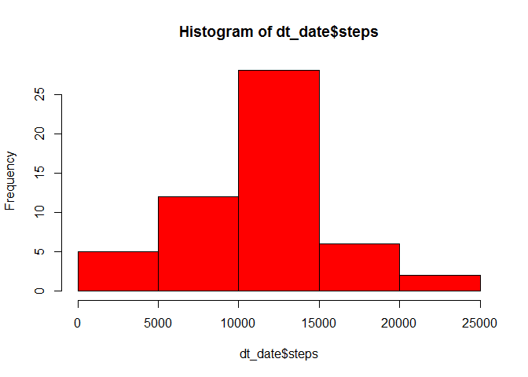
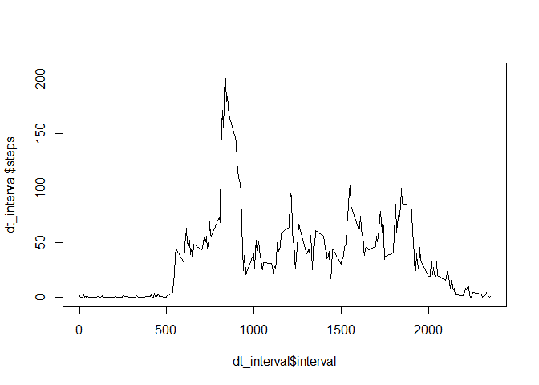
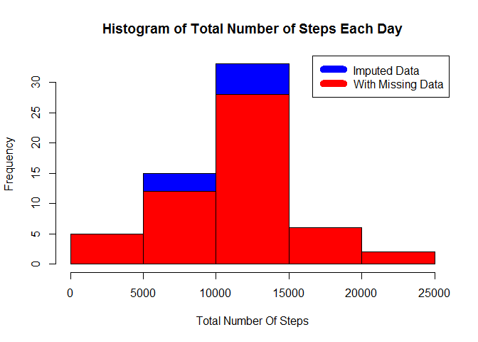
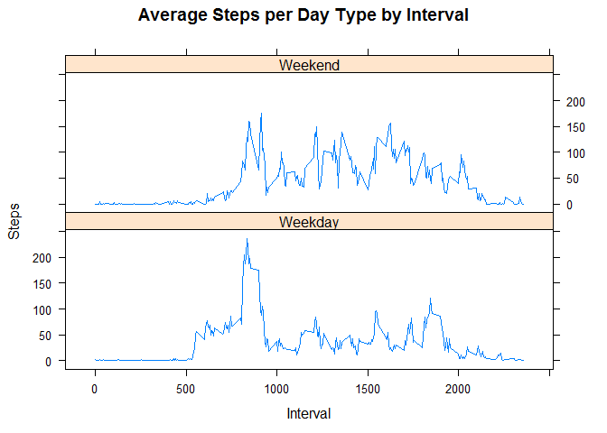

# Reproducible Research: Peer Assessment 1


## Loading and preprocessing the data


```r
#We load the packages and the data
library(plyr)
library(lattice)
dt<-read.csv(unzip("activity.zip"))
#and setting the system language to english (for windows users)
Sys.setlocale("LC_TIME", "English")
```

```
## [1] "English_United States.1252"
```

```r
options(scipen = 1000)


#Then we get the weekdays and the DateTime
dt$day <- weekdays(as.Date(dt$date))
dt$DateTime<- as.POSIXct(dt$date, format="%Y-%m-%d")
```


## What is mean total number of steps taken per day?

```r
dt_date<-aggregate(steps~date,dt,sum)
hist(dt_date$steps,col="red")
```

<!-- -->

```r
mean1<-round(mean(dt_date$steps),4)
median1<-round(median(dt_date$steps),4)
```
The mean total number of steps taken per day is 10766.1887 and the median is 10765 . 

*I round the numbers to 4 decimal places for better understanding and to avoid too long numbers.*

## What is the average daily activity pattern?

```r
dt_interval<-aggregate(steps~interval,dt,mean)
plot(dt_interval$steps~dt_interval$interval,type = "l")
```

<!-- -->

```r
mpd<-dt_interval[dt_interval$steps==max(dt_interval$steps),"interval"]
```
The 5-minute interval containing the maximum number of average steps is 835 .


## Imputing missing values


```r
nas<-nrow(dt[is.na(dt$steps),])
```
The total number of missing values is 2304 .


```r
#We get the data without missing values and find the averages per interval and weekday

non_na <- dt[!is.na(dt$steps),]
avgTable <- ddply(non_na, .(interval, day), summarize, Avg = mean(steps))
#Then we find the na data and merge them with the averages with found to fill the missing values.
nadata<- dt[is.na(dt$steps),]
newdata<-merge(nadata, avgTable, by=c("interval", "day"))
newdata<- newdata[,c(6,4,1,2,5)]
names(newdata)<- c("steps", "date", "interval", "day", "DateTime")
#In the end we combine the imputed values with the data without missing values and we create a data set that is equal to the original dataset.
newData <- rbind(non_na, newdata)

dt_date2<-aggregate(steps~date,newData,sum)

hist(dt_date2$steps,col="blue",main="Histogram of Total Number of Steps Each Day",xlab="Total Number Of Steps")
hist(dt_date$steps,add=T,col="red")
legend("topright",c("Imputed Data","With Missing Data"),
       col = c("blue","red"),lwd=10)
```

<!-- -->

```r
mean2<-round(mean(dt_date2$steps),4)
median2<-round(median(dt_date2$steps),4)
meandif<-round((mean2-mean1),4)
mediandif<-round((median2-median1),4)
tldif<-round(sum(dt_date2$steps)-sum(dt_date$steps),4)
```
The mean for the new dataset is 10821.2096 and the median is 11015 .
The difference in the means is 55.0209 and the difference in the medians is 250.
The total difference in the total steps in the 2 datasets is 89485.7857 .

## Are there differences in activity patterns between weekdays and weekends?


```r
#We create a new column that has two groups, weekends or weekdays.

newData$weekend<-ifelse(newData$day %in% c("Saturday", "Sunday"), "Weekend", "Weekday")

#Last step was to find the averages for weekend and weekdays and plot it.

steps_last<-aggregate(steps~interval+weekend,newData,mean)
xyplot(steps_last$steps~steps_last$interval|steps_last$weekend, main="Average Steps per Day Type by Interval",xlab="Interval", ylab="Steps",layout=c(1,2), type="l")
```

<!-- -->


